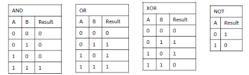

<h1 align="center">Bits && Bitmask</h1>

  <h3>What is a bit?</h3>
  Well... something well known that a bit is a minimum component for a computer to function. So, a bit is a way in which it is possible to communicate with the computer, so it is possible to say that bits are a way to indicate various instructions and establish communication between the computer with a human.
Therefore, the instructions are actually a set of bits.
  <hl>
  <h3>What is the value of a bit?</h3>
  It is easy to answer that, 0 or 1. So we can give another interpretation of these values as true or false. And, with this information, we can understand the following concept.
  <hl>
    
  <h3>Array of Booleans</h3>
  In this case, we can understand the need to define an array with a boolean value so that we can get an array where the values are true or false. It is possible to mention that it is a data structure, so this data structure can only have true or false, but the other concept that we can introduce here is to interpret boolean values as bits. So that's why it's possible to have an array where the values are 1 or 0, and it's the same whether we have an array with true or false values.
What is the purpose of this explanation?
Well, the powerful thing about this concept is in the idea of an integer, the structure of an integer in C++ or any language, well the structure of an integer in computer science there are bits. So an integer is just a set of bits that are stored in memory consecutively, simple as that.
  <hl>
  Thus, here it is possible to represent in different ways the concept of an integer, but it is mandatory to understand the fact that an integer is a set of bits. When we remember the value of an integer we can know the fact that the size of an integer is 4 bytes.
  
  <hl>
  
  <h3>BitMask</h3>
  Bitmasking is a programming technique that involves using bitwise operations to manipulate and extract information from an integer number in its binary form. Essentially, it involves using a binary mask or pattern to select, modify, or compare a specific
  
   <hl>
  For example, if we want to get the value of the bit at position 3 in an integer number, we can apply a bitwise AND operation between the number and a binary mask that has a 1 at position 3 and zeros at all other positions. If the result of this operation is non-zero, then we know that the bit at position 3 of the number is 1; otherwise, it is 0.
     
  <hl>
  Pay attention here, because we have another important concept about bits, and that is Bitwise.
  <hl>
  
  <h3>Bitwise</h3>
  Bitwise refers to the manipulation of data at the level of individual bits. Bitwise operations, such as AND, OR, XOR, and bit shifting, are used to manipulate and compare data in its binary representation.
  
    
    <hl>
  
  <h3>Operations</h3>
  

   
      <hl>
  <h3>Aplications</h3>
  <ol>
    <li>Multiply/divide an integer by 2:  we only need to shift the bits in the integer left/right, respectively.
        34 ==  100010 
          34*2 == 68 == 1000100 == S << 1
        S >> 2 = S / 4 = 17 = 10001
    </li>
    
    <li>To set/turn on the j-th: the bitwise OR operation.
         100010 OR 001000 == 101010
    </li>
    
    <li> To check if the j-th item of the set is on: use the bitwise AND operation
    </li>
    
    </ol>
    
    
      
  <hl>
  This is Bit manipulation.
    

