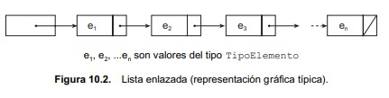

<h1 align="center">Listas</h1>

  Las listas es una estructura la cual bien puede interpretarse como un arreglo dinámico, o sea un arreglo que puede crecer o decrecer durante la ejecución del programa
  de manera eficiente.
  
  Se debe de observar la diferencia con esta estructura y un arreglo normal, la principal diferencia es que un arreglo normal nosotros tenemos dos cosas que podemos 
  hacer:
  <ol>
    <li>Declarar el arreglo ya con un espacio, reservando memoria.</li>
    <li>Declarar el arreglo inicializado.</li>
    </ol>
  
  Y cada uno de estos dos caminos trae consigo problemas debido a que podemos reservar memoria inecesaria o simplemente no conocemos los valores para inicializar.
  
  Es por esto que tener una estructura que me permita ya sea inicializar o simplemente ir agregando a la estructura elementos sin tener que reservar una cierta cantidad
  de memoria con anterioridad hace que se ahorre bastante complejidad de tiempo y espacial. 
  
  Algo que también es necesario mencionar es que podemos tener problemas con la complejidad de tiempo al momento de estar reservando memoria, eso mismo me ocurrió en 
  un problema y la explicación en StackOverflow era sobre estar reservando memoria constantemente que no vamos a ocupar.
  
  <h2 align="center">¿Cómo funciona su implementación?</h2>
  No se va profundizar mucho en este apartado debido a que ya es algo con lo que se ha trabajado constantemente e importa más la función que saber la implementación, 
  pero la implementación de una lista ligada como normalmente se conoce se hace por medio de dos elementos: apuntadores y nodos.
  Los nodos vendrían siendo estructuras donde nosotros podemos estar almacenando un valor, cada uno de estos al estar almacenados en memoria necesariamente tendrán una 
  dirección de memoria, tal que podemos aprovechar esto mismo y usar apuntadores para conectar todos los nodos, y la forma que se hace esto es hacer que un apuntador de
  un nodo esté apuntando a la dirección de memoria de otro nodo, así hasta que el nodo del extremo esté apuntando simplemente a NULL, es por esto mismo que también se 
  debe de observar que el almacenamiento no es memoria continua sino que se ocupa aquel espacio de memoria que se encuentre vacío en ese instante.
  
  De forma gráfica tenemos lo siguiente:
  

  
   
  Es debido a esto que podemos entender esto como una base para las Stacks y Queue debido a que su implementación estaría funcionando parecido debido a que se ocupa 
  apuntadores y se usa el mismo principio de tener un nodo y estar apuntando a direcciones de memoria, obviamente con modificaciones para hacer funcionar a esa 
  estructura de una manera diferente a una lista.
  
  <h2 align="center">Implementación en C++</h2>
  En C++ podemos encontrar la implementación con el nombre de list úbicada en la librería #include < list >, y esta estructura lo que hace es almacenar los datos pero
  no en memoria continua sino en cualquier espacio de memoria que esté libre.
  
  No obstante podemos decir que en sí su implementación sería el vector que hemos estado usando debido que este guarda los elementos en memoria continua, siendo 
  considerado como un arreglo dinámico. La principal diferencia es que una lista tendrá mejores tiempos al momento de insertar elementos que un vector, no obstante
  consume memorial adicional para almacenar punteros al elemento antes y después de un elemento particular, por ende al tener miles de datos puede llegar a ser 
  ineficiente, así que estaremos usando un vector.

