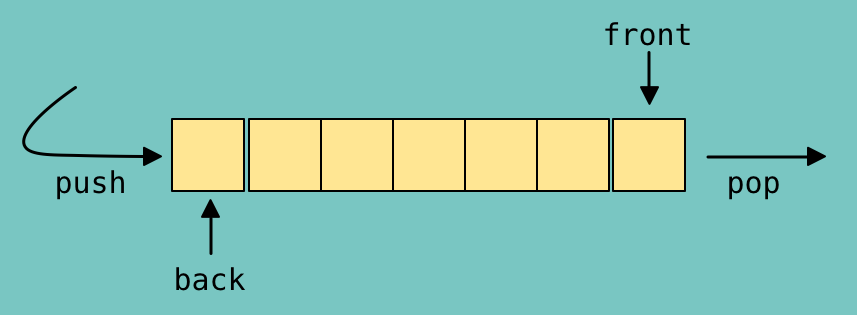

<h1 align="center">Queue in C++</h1>

  En este caso se tendrá esta siguiente estructura la cual es la Queue, esta estará funcionando de la siguiente manera.
  
  Supongamos que vamos al cine y lo usual es que encontremos una fila, lo que hacemos es formarnos al final de la fila de tal modo que nosotros tendremos que esperar 
  hasta que todos los que estén adelante de nosotros hasta llegar nuestro turno y salir. De esto tenemos que hacer ver la característica de que el primero en entrar 
  a la fila es el primero en salir, siendo que el último entrar será el último en salir, por lo cual podemos decir que esta estructura es del tipo:
  
  FIFO (First in First Out)
  
  Ahora, normalmente la Queue es implementada usando apuntadores tal que sean nodos que tengan la información y cada nodo tenga un apuntador que esté apuntando a la 
  dirección de memoria del siguiente nodo. Esto se podría decir que se encuentra basado en una lista enlazada, por lo cual sus operaciones serán muy eficientes.
  
  De manera formal, sus operaciones dentro de C++ son las siguientes:
  
  <ol>
    <li>Empty: nos regresa un valor bool indicando si la Queue está vacía o no (false or true). O(l)</li>
    <li>Size: nos regresa un entero indicando el tamaño de la Queue, en caso de que esté vacía pues el tamaño es 0. O(l)</li>
    <li>Front: accede al primer elemento de la Queue. O(l)</li>
    <li>Back: accede al último elemento de la estructura, o sea el más reciente que fue agregado. O(l)</li>
    <li>Push: inserta un elemento al final de la Queue. O(l)</li>
    <li>Pop: quita el elemento que se encuentra en el front O(l)</li>
  </ol>
  
  De manera gráfica lo tenemos de la siguiente manera: 
    
  

  
   
  
  Entonces, podemos entender a la Queue como una estructura de datos que esté implementando una lista enlazada o simplemente un vector, sobreentendido de que se trata 
  de algo dinámico. Tal que esta estructura permita agregar elementos al final del arreglo y eliminar el elemento que se encuentre al principio de esta de una manera
  muy eficiente, además de que nos permite acceder al primer elemento y al último elemento del arreglo o estructura, o sea de la Queue.
  
  <h2 align="center">Ejemplo - Empty arrays</h2>
  
  You are given two arrays each of size n, a and b consisting of the first n positive integers each exactly once, that is, they are permutations. 

  Your task is to find the minimum time required to make both the arrays empty. The following two types of operations can be performed any number of times each taking 1 second:
  
  <ol>
    <li>In the first operation, you are allowed to rotate the first array clockwise.</li>
    <li>In the second operation, when the first element of both the arrays is the same, they are removed from both the arrays and the process continues.</li>
  </ol>
  
  Input format
  <ol>
    <li>The first line contains an integer n, denoting the size of the array.</li>
    <li>The second line contains the elements of array a.</li>
    <li>The third line contains the elements of array b.</li>
  </ol>
  
  Output: Print the total time taken required to empty both the array.
  
  Example - Operation 1:
  
  Perform operation 1 to make a = 3, 2, 1 
  Perform operation 1 to make a = 2, 1, 3
  
  1<=n<=100
  
  url: https://www.hackerearth.com/practice/data-structures/queues/basics-of-queues/practice-problems/algorithm/empty-array-31ed638c/
  
  <h3 >Solution</h3>
  
  Para abordar este problema simplemente hay que fijarse sobre cómo están funcionando las operaciones, la segunda operación no hay problema alguno debido a que se 
  estará entendiendo que al momento que los números de ambos arrays sean los mismos se podrá realizar el eliminación de los números ne ambos arreglos. No obstante
  la primera operación es la que más se debe de prestar atención debido a que nos dice que solo estará funcionando en el primer array, tal que este pueda rotarse 
  en dirección de las manecillas del reloj, y la forma de entender esta operación es observando el ejemplo que nos da el problema tal que se puede observar que a 
  lo que se refiere con rotar el mandar al primer elemento que aparece en el array hasta al final de este, lo cual está muy claro que se tiene una similitud con 
  la operación de acceder al front de la queue para sacarlo y hacer un push y agregar al final de array nuevamente.
  
  De manera que podemos simular este problema directamente usando una Queue y así obtener una solución.
  
  
  

