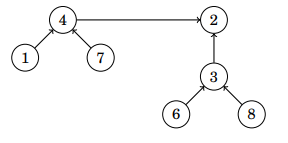

<h1> Union Find structure </h1>
<h2> Complejidad: 
      Union y Encontrar O(log(n)) </h2>

Union Find es una estructura de datos que mantiene una colección de conjuntos disjuntos, los conjuntos no pertenecen a más de un conjunto.

Entonces, esta estructura será para unir conjuntos los cuales pueden lucir de esta forma:

De aquí mismo se observa que hayh conjuntos en forma de vértices, como tipo sub grafos, entonces será posible realizar la unión de estos con la estructura y para realizar
esto es deberá de tener en cuenta que de cada conjunto va a existir un elemento que represente a dicho conjunto, en este caso dicho representante es el vértice que está 
más arriba, de modo que siguiendo el camino de cualquier vértice más abajo nos va a guiar hacia este representante. Por lo cual, dos conjuntos pueden ser unidos por 
medio de los representantes de cada conjunto.

 
<h2>Unión de conjuntos</h2>
Esto se realiza por medio de la unión de los representantes de los conjuntos, por lo cual será tan solo unir el representante de un conjunto a otro conjunto, lo 
siguiente será preguntarse sobre... 

¿De dónde a dónde se realiza la unión?
La estrategía planteada para esto será simplemente unir el representante de aquel conjunto con menor número de elementos con el representante del conjunto de mayor
número de elementos. De forma que quedará como representante el que tenga mayor número de elementos en su conjunto.

De modo que anteriormente se tenía al número 4 como representante de su conjunto y este se unió al representante 2 debido a que su conjunto tiene mayor cantidad de 
elementos.

<h2>Find</h2>
Al final del día podemos ver esto como una cadena de modo que al seguir esta estrategía podemos hacer que la longitud se conserve de log(n), y esto mismo nos da el
siguiente acercamiento que será encontrar el representante de un conjunto puesto que al ser de longitud log(n) tan solo debemos de seguir esa "cadena" o camino 
para encontrar el representante del conjunto haciendo que dicha operación también sea tiempo log(n).

 
<h2>Saber si dos elementos están en el mismo conjunto</h2>
Para saber esto será necesario ver el representante únicamente, si el representante de ambos elementos resulta ser el mismo entonces dichos elementos se encuentran 
en el mismo conjunto.

Esto mismo se entiende debido a que el representante tal cual será el que esté enfrente de todo el conjunto, por eso será lo único que se deberá de checar.

<h2>Implementación (Handbook programming competitive)</h2>
Esta implementación consiste en primero realizar dos vectores, uno en donde se estarán almancenando los conjuntos y otro en donde se tenga los representantes de cada
conjunto, lo cual será de gran ayuda al momento de realizar las operaciones.
